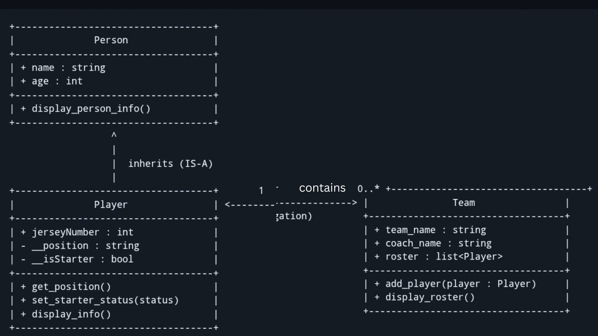
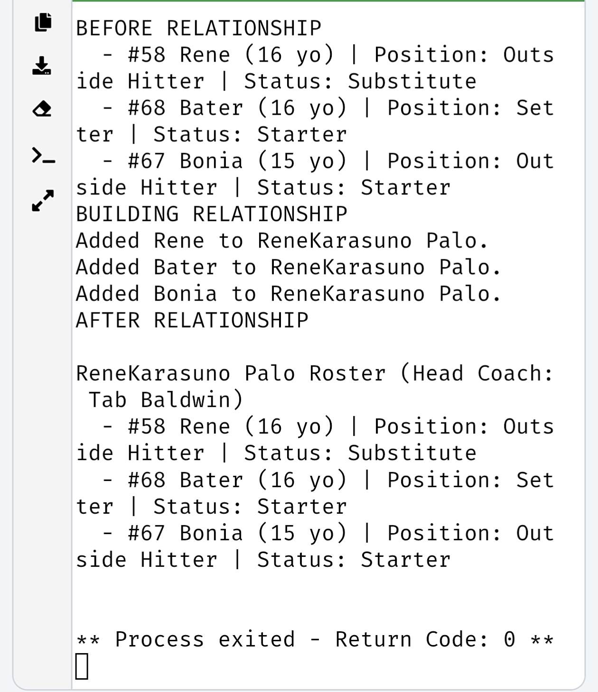

# Advanced Class Relationships
## Previous Activities
[classAttrib](https://github.com/ntzenarosa-ui/9magnesiumcs3/blob/main/q1/classAttributesMethods.md)    
[classRel](https://github.com/ntzenarosa-ui/9magnesiumcs3/blob/main/q1/classRelationships.md)
## Existing System Description:
This system represents a volleyball management setup consisting of a "Team" and individual "Player". In the previous activity, a " Team" maintained a 1 or more association with "Player" by storing them in a roster list.
## Inheritance Relationship   
Parent: Person   
Child: Player   
Explanation: A "Player" IS-A "Person". Every player naturally possesses personal traits such as a name and age, while also having some sports properties like a jersey number, court position, and starter status.   
## Inheritance UML

```text
+-----------------------------------+   
|              Person               |   
+-----------------------------------+   
| + name : string                   |   
| + age : int                       |   
+-----------------------------------+   
| + display_person_info()           |   
+-----------------------------------+   
                  ^
                  |
                  |  (IS-A / Inherits)                                        Parent
+-----------------------------------+
|              Player               |
+-----------------------------------+
| + jerseyNumber : int              |
| - __position : string             |
| - __isStarter : bool              |
+-----------------------------------+
| + get_position()                  |
| + set_starter_status(status)      |
| + display_info()                  |
+-----------------------------------+
```
## Composition/Aggregation
Relationship:
Explanation:
## Advanced UML Diagram

## Python Implementation
[Source Code](advancedRelationships.py)
## Test Run

## Object Diagram


## Reflectionsentsildildild